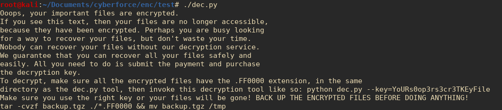
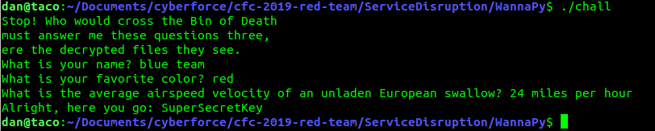

# WannaPy

This file is a drop-in bomb that will encrypt everything in the current directory
AS WELL AS SUBDIRECTORIES RECURSIVELY! If you run wanna.py on a system with
standard python3 libraries, it will wait 5 seconds before encrypting everything in
the current directory. It will then output a randomly generated key to STDOUT. You
should copy this key and save it locally, because without this key the files cannot
be decrypted!

## This is for educational purposes ONLY!

In fact, this was the file's original intent. I developed this application to be
used in the [2019 Cyberforce Competition](https://cyberforcecompetition.com) as a means of service disruption.
The intention was for other red teamers to have a quick and dirty way of using
ransomware on a compromised machine during Stage 4, the "total carnage" stage. In
fact I was completely humbled when I was informed that many red teamers had deployed
this to their rival blue teams successfully!

I am not going to pretend that this is the best code I've ever written, and I know I
can do better, but given the time constraints of the challenge I felt that this was 
not bad for a couple hours of development.

All encrypted files will be given the extension filename.txt.FF0000

## NEW AS OF 11/7

This script will now encrypt all files in the current directory AS WELL AS ALL FILES
IN SUBDIRECTORIES RECURSIVELY! It is even more destructive than ever. Also added
some try traps for when a blue teamer tries to guess the decryption key.

## NEW AS OF 11/16

With special thanks to Richard Alcalde, this code now works for Windows 10. This is
included in the provided zip files. Will probably work on making this a bit more
portable in the future.

## Operation

All files affected are encrypted with Fernet AES encryption, and are reversible as
long as the correct 32-byte key is provided. The key will be output as a base64
encoded string.

After it encrypts all files, it creates a new file: dec.py. Running this script
without any arguments will output the usage, which is similar text to the WannaCry
ransomware text.



To use, upload ONLY wanna.py to the remote server you are connecting to, then run
it like so:

```bash
target:~# python3 ./wanna.py
```

Once it runs, copy the key that the script prints to the screen, remove wanna.py,
and you're done! I've included dec.py as well, but you don't need to upload this
as the wanna.py script will create the file itself on the target.

## Bonus Binary Exploitation Challenge

I have also included a C program with hard-coded questions, that is deliberately
obfuscated to circumvent someone from simply using "strings" to get the answers.
That said, technically you could obtain the key by using strings, but it would
most likely be chopped up and potentially unreliable.

Regardless, the answers are readily available online, and is mostly to slow down
a blue team more than stop them dead in their tracks.

The output of the file, as well as the answers to the questions:


To modify, download the challenge.c file, modify the line where it expects the
decryption key, then compile it:

```bash
$ gcc ./challenge -o hiblueteam
```
